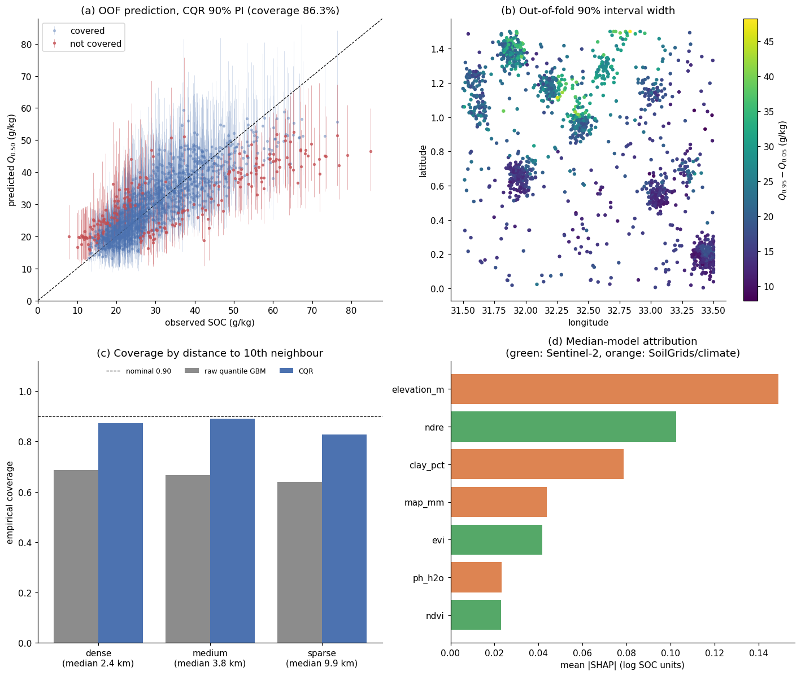

# sentinel-soil-uncertainty

Can Sentinel-2 indices plus soil covariates give soil carbon intervals that stay honest in unsampled areas?

This repository tests that question on **semi-synthetic data**: prediction of topsoil soil organic carbon (SOC, g/kg) from Sentinel-2 vegetation indices fused with ISRIC SoilGrids-style covariates. The model outputs a 90 % prediction interval $[Q_{0.05}, Q_{0.95}]$ as well as a median. Everything is evaluated under spatial block cross-validation, and the intervals are calibrated with conformalized quantile regression (CQR).

All data here are semi-synthetic. Sample locations, covariates and SOC values are simulated by `src/data_generator.py`, not measured. The generating process is known, which makes it possible to check whether the uncertainty estimates behave as intended. None of the numbers below describe a real landscape.

## Relation to the MONAI fusion model

This repository tests whether the input design of an early-fusion network, first built for medical imaging with MONAI, carries over to Earth-observation tabular data. In early fusion, the modality-specific feature vectors are concatenated before any learner sees them, and here that is done directly: three spectral indices and four soil/terrain/climate covariates form a single 7-column design matrix. The CNN encoders do not carry over. At ~1.5k samples with 7 features a gradient-boosted tree ensemble is the appropriate learner, and a neural network would add variance without adding signal.

## Repository layout

```text
src/data_generator.py      semi-synthetic S2 + SoilGrids + SOC generator; raster/GeoPandas helpers
src/model.py               quantile LightGBM, CQR, spatial block CV with buffer, metrics
notebooks/01_multimodal_soc_uncertainty.ipynb   end-to-end analysis (executed, outputs committed)
figures/                   plots written by the notebook
```

## Installation and execution

```bash
python -m venv .venv
source .venv/bin/activate          # Windows: .venv\Scripts\activate
pip install -r requirements.txt

python src/data_generator.py       # writes data/soc_synthetic.csv (seed 42, 1500 samples)
python src/model.py                # pooled spatial-CV metrics, ~30 s on one core
jupyter lab notebooks/01_multimodal_soc_uncertainty.ipynb
```

### Reproducibility

The notebook regenerates the CSV if it is missing. `set_global_seed` fixes the `random`, NumPy and `PYTHONHASHSEED` seeds, and it also seeds `torch` if it is installed, so this code and the MONAI fusion code can share one seeding convention. scikit-learn and LightGBM receive their seeds per estimator. LightGBM runs single-threaded with `deterministic=True`, which makes the results bit-reproducible on a given platform. Multithreaded histogram construction changes floating-point summation order.

## Data generation

`src/data_generator.py` simulates the measurement chain rather than sampling features and target independently.

| Component | Mechanism |
| --- | --- |
| Sample locations | 80 % in 14 unequal-sized Gaussian clusters (accessible survey sites), 20 % uniform background. 48 occupied 0.25° blocks with 1–189 samples each. |
| Environmental fields | Gaussian random fields (random Fourier features) for elevation, rainfall, clay, pH. Rainfall increases with elevation, and pH decreases with rainfall. |
| SOC response | $\log \text{SOC}$ is a function of clay saturation $c/(c+25)$, $\tanh$ of rainfall, elevation cooling, a quadratic pH penalty, a clay × moisture interaction, and a short-range (0.15°) spatial residual field. The process noise SD rises from 0.10 to 0.24 (log units) at wet sites. |
| Sentinel-2 | Linear mixing of vegetation and bare-soil endmembers in B2/B4/B5/B8. Soil brightness decreases with SOC, and canopy chlorophyll shifts B5. NDVI, EVI and NDRE are computed from the mixed reflectances. |
| Observation error | 3 % radiometric noise; 10 % of samples carry undetected haze (additive path radiance, strongest in blue); SoilGrids error (pH ±0.4, clay ±7 %), SRTM ±6 m, rainfall ±6 %; 5 % lab error on SOC. |

## Method

**Quantile models.** One LightGBM regressor per $\tau \in \lbrace 0.05, 0.50, 0.95 \rbrace$, trained with the pinball loss $L_\tau(y,q) = \max(\tau(y-q), (\tau-1)(y-q))$. The target is $\log(\text{SOC})$. Quantiles are equivariant under monotone transforms, so exponentiating the predicted log-quantiles gives SOC quantiles with no retransformation bias. Quantile crossing is removed by sorting each row (monotone rearrangement).

**Spatial cross-validation.** 5-fold `GroupKFold` on `spatial_block_id` puts every block entirely in train or entirely in test. Training points within 5 km of any test point are also dropped, which removes 30–143 points per fold. Without the buffer, points just across a block edge share the spatially correlated residual with test points and inflate the scores.

**Calibration (CQR).** Within each outer training fold, 20 % of *blocks* are held out as a calibration set. Quantile models are fitted on the remaining blocks, and the interval is widened by the conformal quantile of $E_i = \max(\hat q_{lo} - y_i,\; y_i - \hat q_{hi})$ on the log scale (Romano et al., 2019). Calibrating on whole held-out blocks rather than random points keeps the calibration set as far from the training data as the test set is.

**Metrics.** $R^2$, MAE and RMSE of $Q_{0.50}$; PICP (empirical coverage of the 90 % interval); MPIW (mean width, g/kg); interval score (width + $2/\alpha$ × miss distance).

## Results (semi-synthetic data; out-of-fold, 1500 samples, 5 folds, 5 km buffer)

| Variant | $R^2$ | MAE (g/kg) | RMSE (g/kg) | Coverage (PICP) | MPIW (g/kg) | Interval score |
| --- | --- | --- | --- | --- | --- | --- |
| Raw quantile GBM | 0.696 | 4.98 | 6.88 | **66.4 %** | 12.69 | 37.5 |
| CQR | 0.680 | 5.15 | 7.06 | **86.3 %** | 19.81 | 28.8 |

- **Point accuracy and interval calibration are separate questions.** The raw model's median has $R^2 \approx 0.70$, but its nominal 90 % interval covers only 66 % of held-out observations. The pinball-loss fit is honest about the conditional distribution of the training blocks. It does not account for the extra error that comes from predicting in unseen blocks.
- **CQR corrects most of the gap.** The log-scale offset averages ×1.12 multiplicative widening, raises coverage to 86 %, and lowers the interval score from 37.5 to 28.8, so the wider intervals are a net improvement. The CQR median is slightly worse because it is fitted on 80 % of the training blocks.
- **Coverage varies by fold, from 0.70 to 0.92** under CQR. Fold 3 falls to 0.70 because its calibration offset (0.069) was about half that of the other folds. With ~10 calibration blocks per fold, the offset is itself noisy.
- **Pooled coverage is still 3–4 points below nominal.** The CQR guarantee requires calibration and test points to be exchangeable. Different blocks sample different parts of the environmental gradient, so they are not exchangeable.
- **Misses are concentrated at the tails.** The median shrinks towards the mean: SOC above ~55 g/kg is under-predicted and falls above $Q_{0.95}$ (panel (a) of `figures/diagnostics.png`).
- **Attribution.** Sentinel-2 indices account for 36 % of mean |SHAP| in the median model. NDRE ranks second after elevation, while NDVI ranks last. This matches the generator, where NDVI saturates at high vegetation cover and the red edge still responds to chlorophyll.



### Sampling density

The intervals do **not** widen in sparsely sampled areas. The Spearman correlation between interval width and distance to the 10th-nearest sample is 0.06. A quantile GBM conditions only on the features. It has no notion of distance to training data, so a sparse location whose covariates look typical gets a typical interval. The failure shows up as lower coverage:

| Density tercile | Median 10-NN distance | MAE | PICP raw | PICP CQR | MPIW CQR |
| --- | --- | --- | --- | --- | --- |
| dense | 2.4 km | 4.71 | 0.686 | 0.872 | 18.7 |
| medium | 3.8 km | 4.97 | 0.666 | 0.890 | 20.4 |
| sparse | 9.9 km | 5.26 | 0.640 | 0.828 | 20.3 |

Samples with undetected haze have higher MAE (6.07 vs 4.85 g/kg) and lower CQR coverage (0.82 vs 0.87). Their intervals are only marginally wider.

## Limitations

- **Block size and fold composition.** A block size of 0.25° was chosen to be about the range of the SOC residual field. Smaller blocks would leak spatial information, and larger blocks would leave too few groups for 5 folds plus a calibration split. `GroupKFold` balances folds by sample count, not by geography, so a fold can combine distant blocks. The per-fold metrics depend on this assignment. For real data, derive the block size from a residual variogram, or use distance-based leave-one-out.
- **Buffer width.** The 5 km buffer is shorter than the residual correlation range, so some leakage remains. Increasing it to 10 km lowered pooled $R^2$ from 0.70 to 0.64 in a check run. The score is sensitive to this choice, and a real study should report it alongside the results.
- **Optical data quality.** Haze that survives cloud masking lowers NDVI and NDRE and *raises* EVI, because EVI's blue-band aerosol term over-corrects. The model cannot identify affected samples. In practice, use multi-date median composites and the Sentinel-2 SCL/cloud-probability layers, and propagate the per-pixel valid-observation count as a quality covariate.
- **Covariate error.** SoilGrids values are model predictions at 250 m, not measurements, and their error enters the model as unmodelled input noise. Point samples also face a support mismatch against 10–20 m Sentinel-2 pixels and 250 m SoilGrids cells.
- **Sampling bias.** 80 % of samples are clustered. Both the model and its calibration data are dominated by the conditions at those clusters, and coverage drops in the sparse background. Exchangeability-based calibration cannot fix this. Options are covariate-shift-weighted conformal prediction, or an explicit distance-to-data term in the interval.
- **No area-of-applicability check.** Before mapping wall-to-wall, the prediction domain should be masked where the covariates fall outside the training feature space (e.g. the dissimilarity index of Meyer & Pebesma, 2021).
- **Semi-synthetic ground truth.** No field measurements are used. The SOC response is a hand-specified function. Real SOC also depends on land-use history, erosion and management that neither data source observes, so expect lower $R^2$ and wider intervals on field data.

## Next step: adaptive sampling

The sparse tercile is where coverage fails (0.83 against 0.87–0.89 elsewhere), and the model's interval width does not flag those areas. The next step is to use the model to choose where to sample next. Candidate locations would be ranked by a score that combines CQR interval width with distance to existing samples, or with the area-of-applicability dissimilarity index, because width alone misses sparse areas. A batch of new samples would then be added, the spatial CV rerun, and coverage and MPIW in the sparse tercile compared with random or grid sampling of the same size. The semi-synthetic generator can serve as the ground-truth oracle for this experiment once it can return covariates and SOC at arbitrary candidate coordinates.

## Using real data

`sample_raster_at_points` (rasterio) extracts values from Sentinel-2 composites or SoilGrids GeoTIFFs at sample coordinates. It reprojects from WGS84 and returns nodata pixels as NaN. `to_geodataframe` (GeoPandas) wraps a results table for GIS export. Replace the CSV with a table that has the same column names, and the model and notebook run unchanged.

## References

- Romano, Patterson & Candès (2019). Conformalized quantile regression. *NeurIPS*.
- Chernozhukov, Fernández-Val & Galichon (2010). Quantile and probability curves without crossing. *Econometrica* 78(3).
- Gneiting & Raftery (2007). Strictly proper scoring rules, prediction, and estimation. *JASA* 102(477).
- Roberts et al. (2017). Cross-validation strategies for data with temporal, spatial, hierarchical, or phylogenetic structure. *Ecography* 40(8).
- Poggio et al. (2021). SoilGrids 2.0: producing soil information for the globe with quantified spatial uncertainty. *SOIL* 7.
- Meyer & Pebesma (2021). Predicting into unknown space? Estimating the area of applicability of spatial prediction models. *Methods Ecol. Evol.* 12(9).
